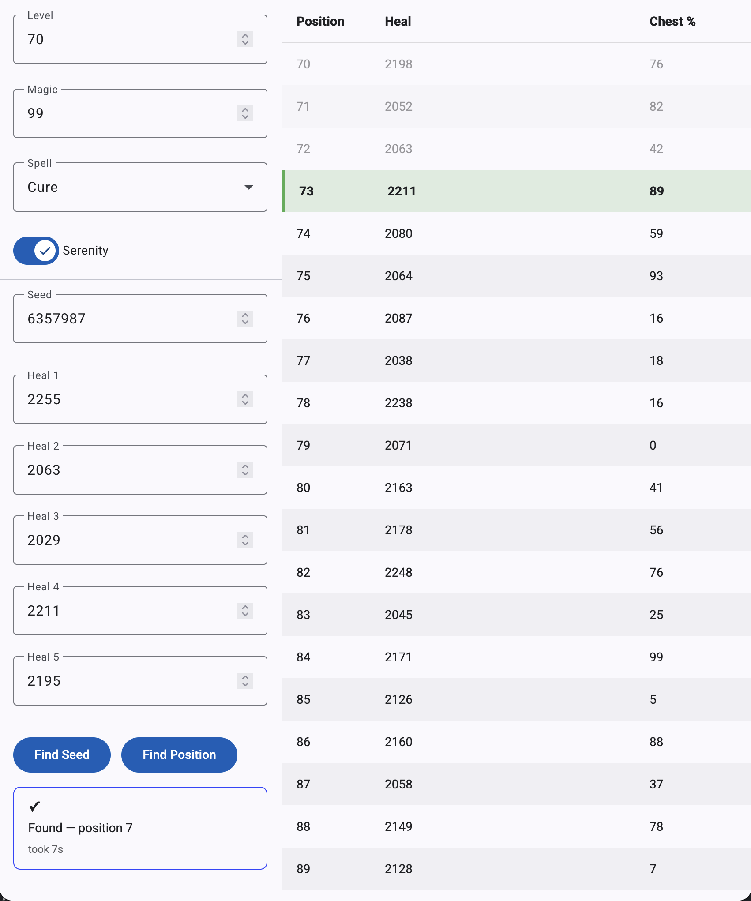

# FFXII TZA RNG Helper

[](https://github.com/TyrantWave/FFXII-TZA-RNG-Helper/actions/workflows/ci.yml)

A tool for tracking and predicting the RNG state in *Final Fantasy XII: The Zodiac Age*. Enter observed cure values to find your current seed and position in the RNG sequence, then see upcoming values to plan your actions.

---

## Screenshot



---

## How it works

FFXII TZA uses a Mersenne Twister (MT19937) RNG. Every heal, chest roll, and many other game events draw from this shared sequence. Because the algorithm is deterministic, knowing your current seed and position lets you predict all future draws.

### Heal formula

```
base  = (2 + magic × (level + magic) / 256) × (1.5 if Serenity else 1.0)
bonus = (rng_value % floor(spell_power × 12.5)) / 100
heal  = floor((spell_power + bonus) × base)
```

Spell power values: Cure = 20, Cura = 46, Curaga = 86, Curaja = 120.

### Finding your seed

On **PS4**, the game always starts from the static seed `4537` — you already know the seed and only need to find your position using **Find Position**.

On **Switch**, the seed is randomised at boot. The tool searches `6,000,000–16,777,216` by default, which covers the observed Switch seed range. For each candidate seed it simulates up to 500 RNG draws and checks whether the observed heal values appear consecutively.

---

## Usage

### Web app

Enter your character stats in the left panel (level, magic, spell, serenity), then enter observed heal values and click **Find Seed** or **Find Position**.

- **Find Seed** — searches the seed space using your observed heals, then automatically finds your position and loads the table to that point.
- **Find Position** — if you already know the seed, finds where your observed heals appear within it and loads the table to that point.

After a successful search, the matched rows are highlighted and the table scrolls to your current position — the first row you haven't cast yet is marked green (next).

**Click any row** to mark it as the last heal you cast. The clicked row fades (past), the row below turns green (next), and the buffer automatically extends so there are always 100 rows ahead to plan with. Clicking a past row moves the marker back — useful if you miscounted.

> **For best results:** cast in an area with no NPCs loaded, and with no active status effects that trigger automatically (Regen, Poison, etc.). NPC movement consumes RNG draws; player movement does not. Multiple party members are fine — Cura and Curaja heal the whole party, giving more numbers per cast — but note the order the individual heals appear on screen and enter them in that order.

### Web app — URL shortcut

Append `?heals=val1,val2,...` to the URL to pre-fill the heal inputs and kick off a seed search automatically on load. Useful for bookmarking a known test case:

```
http://localhost:4200/?heals=2255,2063,2029,2211,2195
```

### CLI

A command-line tool is included for quick testing and verification. It supports both modes and all spell/stat configurations.

```bash
cargo build -p ffxii_tza_rng --release
```

**Find seed** — searches the full seed space for the given observed heals:

```bash
./target/release/ffxii_tza_rng find-seed <level> <magic> <spell> [--no-serenity] <val1> [val2 ...]

# Examples
./target/release/ffxii_tza_rng find-seed 70 99 Cure 2255 2063 2029 2211 2195
./target/release/ffxii_tza_rng find-seed 70 54 Curaja --no-serenity 3794 3582 3622 3628 3648
```

**Find position** — if you already know the seed, locates where a sequence of heals falls within it:

```bash
./target/release/ffxii_tza_rng find-position <seed> <level> <magic> <spell> [--no-serenity] <val1> [val2 ...]

# Example
./target/release/ffxii_tza_rng find-position 6357987 70 99 Cure 2255 2063 2029 2211 2195
```

The first lookahead row (your next cast) is highlighted in green in a terminal.

Output (both modes):
```
Seed:     6357987
Position: 7
Elapsed:  7s

Matched + next 5 values:
  pos     3  cure=2255    chest=82%
  pos     4  cure=2063    chest=42%
  pos     5  cure=2029    chest= 9%
  pos     6  cure=2211    chest=39%
  pos     7  cure=2195    chest=73%
  pos     8  cure=2131    chest=10%   # next cast — printed in green
  pos     9  cure=2233    chest=61%
  pos    10  cure=2079    chest=58%
  pos    11  cure=2264    chest=91%
  pos    12  cure=2177    chest=55%
```

Spell options: `Cure`, `Cura`, `Curaga`, `Curaja`. Serenity is on by default; pass `--no-serenity` to disable it.

---

## Project structure

```
/
├── ffxii_tza_rng/          # Core Rust library — RNG, formula, seed search
├── ffxii_tza_rng_wasm/     # wasm-bindgen wrapper exposing the library to JS
└── frontend/               # Angular app
    └── src/
        ├── app/
        │   ├── services/   # WasmService — WASM lifecycle and worker bridge
        │   └── components/ # CharacterPanel, ControlsPanel, ValuesTable
        └── workers/        # Web Worker for non-blocking seed search
```

### Tech stack

| Layer | Technology |
|-------|-----------|
| Core library | Rust 2021 |
| WASM bindings | wasm-bindgen, wasm-pack |
| Frontend | Angular 21, Angular Material |
| Reactivity | Angular signals (zoneless) |
| Seed search | Web Worker (non-blocking) |
| Tests | `cargo test` (Rust), Vitest via `ng test` (Angular) |

---

## Development

### Prerequisites

- Rust (stable)
- [wasm-pack](https://rustwasm.github.io/wasm-pack/)
- Node.js + npm
- Angular CLI (`npm i -g @angular/cli`)

### Build the WASM package

```bash
cd ffxii_tza_rng_wasm
wasm-pack build --target web --out-dir pkg
```

The `frontend/public/wasm/` directory and `frontend/node_modules/ffxii-tza-rng-wasm` are both symlinked to `pkg/`, so a rebuild is picked up immediately with no copy step.

### Run the app

```bash
cd frontend
npm install
ng serve
```

### Run tests

```bash
# Rust core
cargo test -p ffxii_tza_rng

# Angular
cd frontend && ng test --no-watch
```

---

## Verified seeds

These seed + value combinations have been confirmed against real gameplay on Nintendo Switch:

| Seed | Character | Values (consecutive heals) |
|------|-----------|--------------------------|
| 6,357,987 | lvl 70, mag 99, Cure, Serenity | 2255, 2063, 2029, 2211, 2195 |
| 6,541,629 | lvl 70, mag 99, Cure, Serenity | 2071, 2134, 2220, 2062, 2086 |
| 8,018,931 | lvl 70, mag 54, Curaja, no Serenity | 3794, 3582, 3622, 3628, 3648 |
| 7,849,347 | lvl 45, mag 68, Cura, Serenity | 2243, 2339, 2462, 2286, 2362 |
